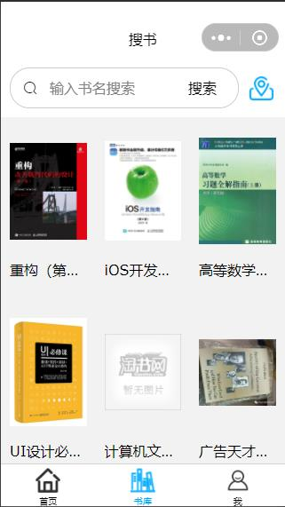
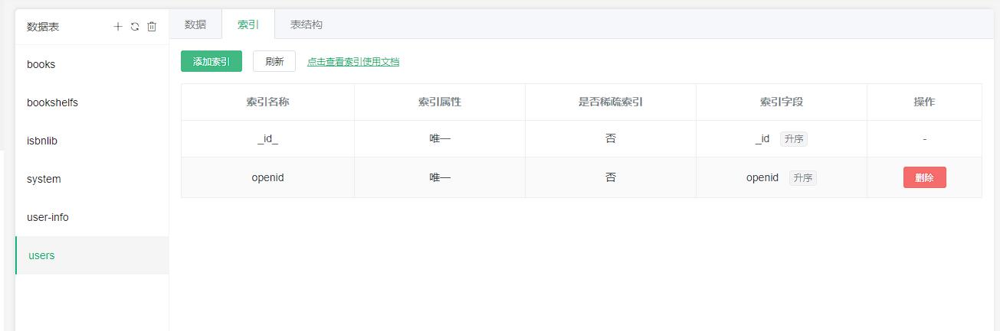

# np-book
### 预览

### 欢乐书刊
##### 一款用于记录和分享个人喜欢的书刊小程序。包含isbn码识别、收藏、分类书刊等功能，想发现更多别人喜欢的书刊吗~，通过以下方式体验：

#### 微信小程序：同城欢乐书刊

### 使用说明
 - 注册自己的微信小程序并获取appid和secret
 - 将appid和secret填写到云函数文件夹cloudfunctions/common/wx-common/index.js中
 - 注册自己的uniCloud服务，并创建关联一个阿里云服务空间
 - 云数据库每个数据表需配置索引，如：
 
